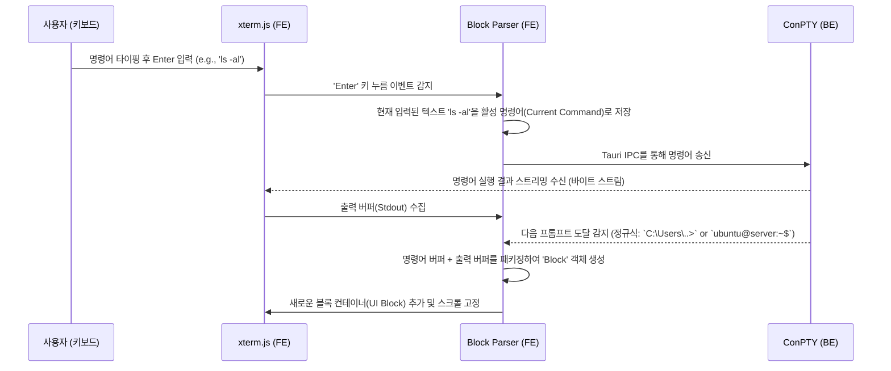
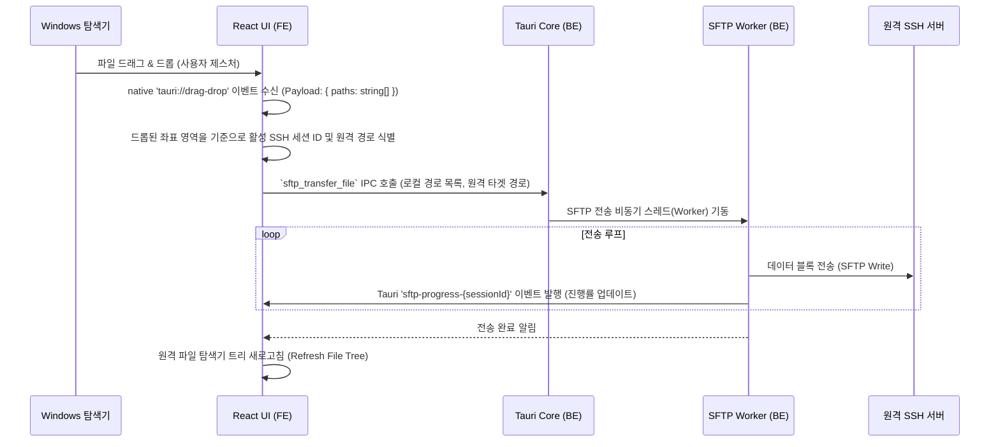

# Software Design Document (SDD)
## 프로젝트명: Terminal Avy (터미널 에이비) 소프트웨어 상세 설계서

본 문서는 `3_Plan.md` 개발 계획을 실행하기 위한 **Software Design Document (SDD)** 입니다. 본 설계서는 Terminal Avy의 시스템 상세 아키텍처, 구성 모듈별 세부 데이터 구조, Tauri IPC 인터페이스(API) 설계, 주요 기능의 시퀀스 흐름, 그리고 UI/UX 세부 사양을 기술하여 실제 구현에 즉시 투입할 수 있도록 돕습니다.

---

## 1. 시스템 상세 아키텍처 (System Architecture Details)

Terminal Avy는 Rust 기반의 네이티브 런타임인 **Tauri v2 Backend Core**와 Chromium 기반 웹뷰에서 구동되는 **React/TypeScript Frontend**로 구성됩니다. 두 영역은 IPC 통신과 비동기 스트리밍 채널을 통해 원활히 데이터를 교환합니다.

### 1.1. 주요 프로세스 및 스레딩 모델
* **Main Process (Rust)**: Tauri App 인스턴스 제어, 창 상태 및 시스템 트레이 제어, 백엔드 보안 정책 매핑
* **Worker Threads (Rust)**:
  * **ConPTY Worker**: 각 로컬 터미널 세션마다 스레드를 생성하여 PTY 프로세스의 입출력 데이터를 주기적으로 풀링(polling)하고 프론트엔드로 전달
  * **SFTP Transfer Worker**: 대용량 파일 전송 시 메인 스레드가 블로킹되지 않도록 별도 스레드 풀에서 SCP/SFTP 파일 스트림 처리
* **Webview Thread (Frontend)**: React 기반 렌더링, Monaco Editor 탑재, xterm.js 터미널 인스턴스 관리 및 native `tauri://drag-drop` 이벤트 감지

### 1.2. Tauri v2 보안 및 권한 (Capabilities) 모델
Tauri v2부터는 과거의 `allowlist` 방식 대신 **Capabilities** 보안 모델을 사용합니다. 프론트엔드에서 호출 가능한 백엔드 명령어와 접근 가능한 시스템 리소스 범위는 `src-tauri/capabilities/default.json`에 정의되어야 합니다.
* **필수 권한 설정 구성**:
  * `fs`: 로컬 파일 탐색기를 위한 파일 읽기/쓰기 권한 허용
  * `event`: `tauri://drag-drop`, `sftp-progress` 등의 이벤트 리스너 허용
  * `custom-commands`: 터미널 PTY 제어 및 SSH/SFTP 연결을 위해 설계된 커스텀 Rust command (`start_pty_session`, `connect_ssh` 등) 실행 권한 정의

---

## 2. 데이터 디자인 및 파일 스토리지 (Data & Storage Design)

앱의 영구 설정, 세션 구성 상태 및 사용자 프로필은 로컬 사용자 애플리케이션 데이터 디렉터리(`%APPDATA%/TerminalAvy/` 등) 내에 JSON 형식으로 저장됩니다.

### 2.1. 애플리케이션 설정 스키마 (`config.json`)
```json
{
  "theme": "dark-glass",
  "fontSize": 14,
  "fontFamily": "D2Coding, 'Fira Code', monospace",
  "llmSettings": {
    "provider": "ollama",
    "endpoint": "http://localhost:11434",
    "modelName": "llama3",
    "apiKey": "",
    "systemPrompt": "You are a professional terminal assistant. Provide concise command solutions and help debug errors."
  },
  "profiles": [
    {
      "id": "profile-01",
      "name": "Backend Dev Env",
      "layout": {
        "type": "split",
        "direction": "horizontal",
        "sizes": [30, 70],
        "children": [
          {
            "type": "pane",
            "sessionId": "session-local-1"
          },
          {
            "type": "split",
            "direction": "vertical",
            "sizes": [50, 50],
            "children": [
              {
                "type": "pane",
                "sessionId": "session-ssh-1"
              },
              {
                "type": "pane",
                "sessionId": "session-local-2"
              }
            ]
          }
        ]
      }
    }
  ]
}
```

### 2.2. 활성 세션 상태 데이터 구조 (TypeScript Interface)
```typescript
export interface Session {
  id: string;
  title: string;
  type: 'local' | 'ssh';
  status: 'connecting' | 'connected' | 'disconnected';
  fontSize: number;
  connectionInfo?: {
    host: string;
    port: number;
    username: string;
    authType: 'password' | 'keyfile';
    keyPath?: string;
  };
  currentDirectory: string;
}
```

---

## 3. 인터페이스 및 API 디자인 (Interface & API Design)

Tauri v2 규격에 따라 프론트엔드와 백엔드가 주고받는 IPC (Inter-Process Communication) API는 다음과 같이 정의됩니다.
* **프론트엔드 모듈 임포트 규격**:
  * IPC 호출: `import { invoke } from '@tauri-apps/api/core';`
  * 이벤트 리스닝: `import { listen } from '@tauri-apps/api/event';`

### 3.1. 터미널 및 PTY 제어 API (Tauri Commands)

#### 1) `start_pty_session`
* **설명**: 로컬 PTY 세션을 생성하고 백엔드에서 쉘 프로세스 구동
* **파라미터**:
  * `sessionId: string`
  * `shellPath: string` (예: `powershell.exe`, `/bin/zsh`)
* **반환값**: `Result<void, string>`

#### 2) `write_to_pty`
* **설명**: PTY 세션에 사용자 키보드 입력 또는 명령어를 전달
* **파라미터**:
  * `sessionId: string`
  * `data: string` (UTF-8 문자열)
* **반환값**: `Result<void, string>`

#### 3) `resize_pty`
* **설명**: 창 분할이나 윈도우 크기 조정 시 PTY 가상 스크린 행/열 조절
* **파라미터**:
  * `sessionId: string`
  * `cols: number`
  * `rows: number`
* **반환값**: `Result<void, string>`

### 3.2. SSH 및 SFTP 제어 API

#### 1) `connect_ssh`
* **설명**: 원격 SSH 세션을 수립하고 원격 PTY 실행
* **파라미터**:
  * `sessionId: string`
  * `host: string`
  * `port: number`
  * `username: string`
  * `password?: string`
  * `privateKeyPath?: string`
* **반환값**: `Result<void, string>`

#### 2) `sftp_read_dir`
* **설명**: SSH 세션 내 원격 경로의 파일 리스트 조회
* **파라미터**:
  * `sessionId: string`
  * `remotePath: string`
* **반환값**: `Result<Array<FileNode>, string>`

#### 3) `sftp_transfer_file`
* **설명**: 로컬과 원격 간의 비동기 파일 전송 (업로드/다운로드) 트리거
* **파라미터**:
  * `sessionId: string`
  * `direction: 'upload' | 'download'`
  * `localPath: string`
  * `remotePath: string`
* **이벤트 발행**: 파일 전송 상태 변화(Progress %) 시 Tauri Event `sftp-progress-{sessionId}` 발행

---

## 4. 상세 기능 설계 및 시퀀스 플로우 (Detailed Design & Flow)

### 4.1. 명령어 블록화 파싱 흐름 (Warp-style Block Generation)
터미널의 입출력 데이터를 파싱하여 명령어와 그 출력을 하나의 블록으로 캡처하는 흐름입니다.



### 4.2. 외부 탐색기 -> SSH 세션 파일 드래그 앤 드롭 업로드 흐름
Tauri v2의 내장 웹뷰는 윈도우 OS에서 발생하는 드래그 앤 드롭 이벤트를 기본 캡처하여 프론트엔드로 `tauri://drag-drop` 이벤트를 발생시키며, 이 페이로드에 포함된 절대 경로를 통해 SFTP 업로드를 처리합니다.



### 4.3. 드래그 앤 드롭 전송 매트릭스 (Drag & Drop File Transfer Matrix)
시스템은 세션 종류(Local / SSH) 및 출발지-목적지 조합에 따라 다음과 같이 파일을 처리합니다.

| 전송 시나리오 | 동작 방식 및 내부 처리 메커니즘 | 관련 프로토콜 / API |
| :--- | :--- | :--- |
| **로컬 ➔ 로컬** (Local to Local) | 로컬 파일 트리 또는 Windows 탐색기에서 로컬 디렉터리 뷰로 드롭할 때 발생합니다. 동일 드라이브인 경우 `이동(Move/Rename)`, 타 드라이브인 경우 `복사(Copy)` 연산을 수행합니다. | Rust `std::fs::copy` 및 `std::fs::rename` API |
| **로컬 ➔ SSH** (Local to SSH) | 로컬 파일을 SSH 터미널 창 또는 SSH 파일 트리로 드롭할 때 실행됩니다. 백엔드 SFTP 채널을 통해 원격 서버로 파일을 고성능 업로드 스트리밍합니다. | Rust `ssh2-rs` / `russh` SFTP Write 채널 |
| **SSH ➔ 로컬** (SSH to Local) | SSH 파일 트리에서 파일을 드래그하여 로컬 디렉토리 뷰 또는 윈도우 탐색기로 드롭할 때 실행됩니다. 백엔드에서 원격 파일을 스트림으로 다운로드하여 로컬 지정 경로에 씁니다. | Rust SFTP Read + `std::fs::File` Write |
| **SSH ➔ SSH** (SSH to SSH) | **A. 동일 서버 내 이동**: SFTP의 원격 `rename` 또는 복사 명령을 통해 네트워크 대역폭 낭비 없이 원격지 안에서 즉시 처리합니다.<br>**B. 다른 원격 서버 간 전송**: `SSH 서버 A`에서 파일을 다운로드 스트림으로 받아 로컬 디스크에 임시 저장하지 않고, 메모리 버퍼 상에서 즉시 `SSH 서버 B` SFTP 업로드 채널로 중계 전송(Tauri Pipeline)합니다. | Rust SFTP Client Pipeline (Memory buffering stream) |

---

## 5. UI/UX 컴포넌트 세부 사양 (UI Component Specs)

### 5.1. `WorkspaceLayoutManager` (레이아웃 분할 및 창 관리)
* **역할**: 다중 세션 분할 배치를 렌더링하고 활성 창 포커스를 유지하며, 개별 창(터미널, 에디터)의 라이프사이클을 관리합니다.
* **에디터 창 옵션화 및 닫기 (Togglable Editor)**:
  - 에디터 창은 고정형 뷰가 아닌 **'선택적 분할 패널(Pane)'**의 한 종류입니다.
  - 에디터 탭 우측의 닫기(`X`) 버튼이나 단축키 `Ctrl + W` 입력 시 즉시 닫히며, 남은 터미널 창들이 부모 컨테이너 크기 비율에 맞춰 자동으로 채워집니다.
  - 사이드바 파일 트리에서 파일을 더블클릭할 때만 에디터 창이 다시 동적으로 분할 생성되는 온디맨드(On-demand) 방식을 지원합니다.
* **가로/세로 분할 및 크기 조정 (Resizing & Splitting)**:
  - **가로/세로 분할**: 무제한 이진 트리(Binary Layout Tree) 구조를 채택하여 원하는 패널을 계속해서 가로(Horizontal Split) 및 세로(Vertical Split)로 분할할 수 있습니다.
  - **크기 조정 (Resizing)**: 분할된 패널들 사이에 마우스 드래그가 가능한 **'스플리터(Splitter Bar)'**가 렌더링됩니다. 스플리터를 마우스로 움직이거나 더블클릭하여 패널 크기 비율(예: 30:70 ➔ 50:50)을 실시간으로 자유롭게 리사이징할 수 있습니다.
* **상태 관리**:
  * `layoutTree`: 가로/세로 방향, 리사이징 비율, 자식 노드를 포함하는 JSON 레이아웃 트리 구조
  * `panes`: 현재 열려 있는 각 터미널/에디터 인스턴스 배열
  * `activePaneId`: 현재 포커스된 창의 고유 ID
* **단축키 바인딩**:
  * `Ctrl + Shift + D`: 현재 활성화된 패널을 세로로 분할 (Vertical Split)
  * `Ctrl + Shift + E`: 현재 활성화된 패널을 가로로 분할 (Horizontal Split)
  * `Ctrl + W`: 현재 포커스된 패널 닫기 (에디터 창 닫기 가능)

### 5.2. `TerminalBlockContainer` (명령어 블록 컴포넌트)
* **구조**:
  ```html
  <div class="terminal-block group relative border-l-2 border-transparent hover:border-blue-500">
    <!-- 블록 헤더 / 퀵 툴바 (Hover시에만 노출) -->
    <div class="absolute right-2 top-2 opacity-0 group-hover:opacity-100 transition-opacity duration-150 flex space-x-1">
      <button class="icon-btn" title="Copy Command">📋</button>
      <button class="icon-btn" title="Copy Output">📄</button>
      <button class="icon-btn" title="Run Again">🔁</button>
    </div>
    <!-- 실행 명령어 표시 영역 -->
    <div class="command-line font-bold text-green-400 bg-slate-900/50 p-2">
      $ {command}
    </div>
    <!-- 출력 결과 영역 -->
    <div class="output-content text-slate-200 p-2 font-mono whitespace-pre-wrap">
      {output}
    </div>
  </div>
  ```

### 5.3. `AIChatPanel` (하단 고정 AI 패널)
* **위치**: 워크스페이스 하단에 상시 고정 가능하며, 토글 버튼으로 접을 수 있음.
* **기능**:
  * 사용자가 지정한 로컬 LLM 서버(`localhost`)와의 API 통신을 전담.
  * 터미널 블록의 컨텍스트(명령어, 에러 로그)를 전송 가능한 템플릿 처리부 내장.
  * 제안된 명령어 예시 클릭 시, 활성 터미널 세션의 입력 스트림에 자동으로 텍스트 주입 및 실행 기능.

---

## 6. 한글 및 IME 특화 디자인 (Korean Optimization Specs)

* **IME 버그 방지**:
  * 한글 자모가 분리되거나 입력 단어의 마지막 자가 손실되는 현상은 대개 브라우저의 `Composition` 이벤트 처리 미흡 때문에 발생합니다.
  * 입력 에리어는 브라우저의 원시 `<textarea>` 또는 Monaco Editor의 안정적인 입력 파이프라인을 그대로 이용하고, 입력이 완료된 버퍼만 완성형(NFC 정규화 규격)으로 직렬화하여 ConPTY로 전달합니다.
* **글자 폭 정렬 (Ambiguous characters)**:
  * xterm.js 옵션 설정에 `letterSpacing: 0`, `fontFamily` 내에 고정폭 코딩 한글 글꼴(e.g., `D2Coding`)을 1순위로 선언하여 로컬 및 SSH 상에서 한글/영문 정렬이 한 칸(1ch) 및 두 칸(2ch) 단위로 완벽하게 수평선이 맞도록 스타일링합니다.

---

## 7. AI 에이전트 모드 확장성 대비 설계 (Future-Proofing for AI Agent)

향후 터미널 내에서 스스로 명령어를 실행하고 파일을 수정하는 **AI 에이전트 모드**를 원활히 추가하기 위해, 본 아키텍처 단계에서 아래의 디자인 가이드를 준수합니다.

### 7.1. 에이전트 실행 승인 게이트 (Execution Approval Gate)
* **설계 원칙**: AI 에이전트가 제안한 명령어는 프론트엔드의 `AIChatPanel`에서 백엔드의 `write_to_pty`로 직접 쓰여서는 안 되며, 반드시 **중간 승인 큐(Approval Queue)**를 거쳐야 합니다.
* **인터페이스 스키마 (예시)**:
  ```typescript
  interface AgentProposedAction {
    id: string;
    actionType: 'execute_command' | 'edit_file' | 'create_file';
    target: string; // 명령어 스트링 또는 파일 경로
    justification: string; // 에이전트가 실행하려는 이유 설명
    status: 'pending' | 'approved' | 'rejected';
  }
  ```

### 7.2. PTY 출력 브로드캐스트 (PTY Stream Broadcasting)
* **설계 원칙**: Rust 백엔드의 ConPTY 리더 스트림은 단순 단방향 IPC 이벤트 전송을 넘어, 필요 시 에이전트 감시 루프(Agent Observer)로도 출력 바이트가 동시에 복사 전달될 수 있도록 `tokio::sync::broadcast` 또는 Rust의 `mpsc::channel` 분기 구조로 설계합니다.

### 7.3. LLM API 스키마의 Tool Calling 규격 확보
* **설계 원칙**: LLM 커넥터 연동부 설계 시, OpenAI 호환 규격의 `tools` 필드를 수용할 수 있도록 데이터 전송 모델(DTO)을 설계하여 에이전트의 Function Calling 반응이 들어왔을 때 로컬 파일 탐색기(`fs`) 및 PTY 제어 명령어와 매핑할 수 있게 확장 인터페이스를 열어둡니다.

### 7.4. 기술 구현상 잠재적 오류 및 해결 방안 (Technical Pitfalls & Mitigations)
개발 및 컴파일 과정에서 직면할 수 있는 주요 의존성 및 플랫폼(Windows WebView2) 버전 충돌 이슈와 방지 가이드는 다음과 같습니다.

#### 1) Monaco Editor 웹 워커(Web Worker)와 Tauri 커스텀 프로토콜 충돌
* **원인**: Monaco Editor는 구문 분석을 위해 백그라운드 웹 워커를 실행합니다. 그러나 Tauri v2의 커스텀 프로토콜(`tauri://` 또는 `asset://`) 환경에서는 브라우저의 동일출처정책(SOP) 제한으로 인해 워커 파일을 URL 경로로 직접 생성할 수 없어 `"Could not create web worker"` 에러가 발생합니다.
* **해결책**: Vite 번들러 환경에서 `?worker` 접미사를 사용하여 워커 파일들을 명시적으로 번들링하고, Monaco 초기화 직전에 `window.MonacoEnvironment` 객체를 선언하여 수동 매핑해 주어야 합니다.
  ```typescript
  import editorWorker from 'monaco-editor/esm/vs/editor/editor.worker?worker';
  import tsWorker from 'monaco-editor/esm/vs/language/typescript/ts.worker?worker';

  window.MonacoEnvironment = {
    getWorker(_moduleId, label) {
      if (label === 'typescript' || label === 'javascript') return new tsWorker();
      return new editorWorker();
    }
  };
  ```

#### 2) xterm.js WebGL 렌더러와 Windows WebView2 그래픽 충돌
* **원인**: `xterm-addon-webgl`은 뛰어난 GPU 렌더링 성능을 내지만, Windows의 WebView2(크로미움 기반) 환경에서 투명성 테마(`allowTransparency: true`)와 함께 사용할 시 가끔 글자가 깨지거나 잔상이 남는 렌더링 손상(Rendering Corruption) 버그가 존재합니다.
* **해결책**: 렌더러 이중화 설계를 도입합니다. 기본적으로 안정성이 뛰어난 `xterm-addon-canvas` (Canvas 2D 렌더러)를 표준 렌더러로 채택하고, 투명 효과가 제거된 완전 불투명(Opaque) 테마에서만 옵션 형태로 WebGL 렌더러를 켜도록 구현합니다.

#### 3) Rust C-dependency 빌드 도구 오류 (`libssh2`/`OpenSSL` vs Windows MSVC)
* **원인**: SSH 제어를 위해 `ssh2-rs` 크레이트를 단순히 사용할 시, Windows 빌드 환경에 `libssh2` C 라이브러리와 `OpenSSL` SDK가 설치되어 있지 않으면 빌드가 실패합니다.
* **해결책**:
  * 순수 Rust로 구현된 비동기 SSH 라이브러리인 **`russh`**의 적용을 적극 검토합니다.
  * 만약 `ssh2` 크레이트를 유지해야 한다면, 외부에 종속성을 갖지 않고 소스 컴파일되도록 `Cargo.toml`에 `vendored` 옵션을 필수로 활성화합니다:
    ```toml
    ssh2 = { version = "0.10", features = ["vendored-openssl", "vendored-libssh2"] }
    ```

#### 4) Tauri IPC 통신 규격 간 에러 직렬화(Serialization) 이슈
* **원인**: Tauri v2의 명령어 응답은 `serde::Serialize`를 구현해야 하지만, Rust의 `std::io::Error`나 `ssh2::Error` 등의 오류 타입들은 직렬화되지 않아 컴파일 에러를 냅니다.
* **해결책**: 모든 IPC Command 핸들러 내부의 에러 리턴 타입은 문자열(`String`)로 매핑하여 리턴합니다 (`.map_err(|e| e.to_string())`).

#### 5) Windows ConPTY 실행 시 한국어 인코딩 깨짐 (CP949 vs UTF-8)
* **원인**: Windows 환경의 기본 터미널(CMD, PowerShell)은 시스템 로캘에 따라 레거시 코드페이지인 CP949(EUC-KR)를 기본 인코딩으로 사용합니다. 반면, 프론트엔드의 `xterm.js`는 UTF-8 바이트 스트림만 수용하므로 한글 명령어나 출력 결과가 심각하게 깨져서 출력됩니다.
* **해결책**: PTY 세션이 시작되고 쉘 프로세스가 구동된 직후, 백엔드에서 강제적으로 `chcp 65001 > nul` 명령을 주입(Write)하여 활성 콘솔 세션의 코드페이지를 UTF-8로 전환해야 합니다.

#### 6) Monaco Editor 분할 뷰 리사이징 시 크기 미동작 이슈
* **원인**: Monaco Editor는 CSS Flexbox나 Grid의 크기 변화를 스스로 감지하지 못합니다. 따라서 사용자가 스플리터 바를 드래그하여 에디터 창 크기를 조정해도 에디터 내부의 캔버스는 초기 크기로 고정되어 레이아웃이 깨지거나 잘리는 현상이 발생합니다.
* **해결책**: 에디터 컨테이너 요소에 브라우저의 **`ResizeObserver`**를 바인딩하여, 크기 변경(Resize) 감지 시 Monaco API인 `editor.layout()` 함수를 바운스(Debounce) 처리하여 강제 호출해야 합니다.

#### 7) 로컬 LLM 콜드 스타트 및 동기 호출 시 UI 프리징 현상
* **원인**: 로컬 LLM(Ollama 등)은 모델이 메모리에 로드되어 있지 않은 경우 첫 호출 시 모델 로딩(Cold Start)에 최대 10~30초가 소요됩니다. 이때 Tauri IPC를 동기 방식(`sync`)으로 호출하거나 대기하면 프론트엔드 UI 렌더러가 완전히 얼어붙어(Freezing) 응답 없음 상태가 됩니다.
* **해결책**: 백엔드 API를 비동기(`async fn`)로 구성하고, 백엔드에서 Ollama API와 통신할 때 응답을 한 번에 받지 않고 SSE(Server-Sent Events) 스트림 형태로 받아 프론트엔드로 실시간 이벤트(`emit`)를 발행하는 **비동기 스트리밍(Streaming) 아키텍처**를 채택해야 합니다.
