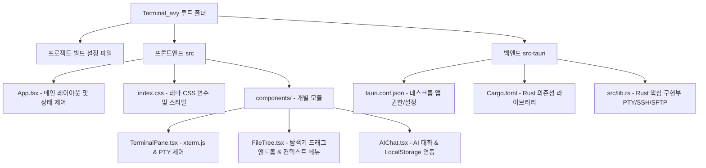

# 필수 백업 요소 가이드 (Essential Backup Guide)

이 문서는 **Terminal Avy Workspace** 프로젝트의 개발 소스코드 및 사용자 설정 데이터를 안전하게 보존하기 위해 반드시 백업해야 하는 핵심 요소들과 프로젝트 구성 요소/기능을 정리한 가이드라인입니다.

---

## 1. 프로젝트 개요 및 핵심 기능

**Terminal Avy**는 Tauri v2 프레임워크를 기반으로 제작된 크로스 플랫폼 데스크톱 터미널 및 작업 환경 관리 도구입니다. 개발자의 생산성을 향상하기 위해 터미널, 파일 탐색기, 코드 에디터, AI 어시스턴트가 유기적으로 통합되어 있습니다.

### 주요 기능 요약
- **다중 터미널 세션 (Multi-session Terminal)**:
  - xterm.js 기반의 고성능 로컬 터미널 및 SSH 원격 터미널 지원.
  - 명령어 실행 블록 단위 감지 및 복사/재실행 퀵 툴바 제공.
  - UI 테마에 맞추어 폰트 크기 개별 조절 및 터미널 전용 색상 테마 동기화.
- **AI 도우미 통합 (AI Assistant)**:
  - 터미널 쉘 에러 자동 진단 및 관련 명령어 추천.
  - 현재 활성화된 터미널 버퍼 내용을 AI 컨텍스트로 제공하여 즉각적인 트러블슈팅 가능.
  - API Key, Base URL, 모델명, 시스템 프롬프트 설정 제공.
- **듀얼 뷰 파일 탐색기 (Dual-Pane File Explorer)**:
  - 로컬 디스크 탐색 및 SSH SFTP 원격 파일 실시간 동기화 탐색.
  - 로컬 ↔ 원격 드래그 앤 드롭(Drag & Drop) 파일 전송 지원.
  - 파일 및 폴더 생성, 복사, 잘라내기, 삭제, 다운로드 기능 및 특정 디렉터리에서 터미널 즉시 실행.
- **코드 에디터 (Code Editor)**:
  - 로컬 및 원격 파일을 파일 트리에서 선택해 즉시 편집하고 저장할 수 있는 내장 에디터 인터페이스.
- **레이아웃 저장 및 복원 (Workspace State Persistence)**:
  - FlexLayout을 통한 유연한 패널 분할.
  - 활성 터미널 세션의 정보(접속 호스트, 포트, 세션명 등)와 레이아웃 구성을 영구 보관/복원.
- **디자인 시스템 & 테마 (7 Professional Themes)**:
  - Outfit 폰트 기반의 모던 UI 디자인.
  - 7가지 테마(Default Dark, Light, Hacker, Nord/Oceanic, Dracula, Monokai, Gruvbox) 지원.

---

## 2. 프로젝트 구성 요소 (Source Code Architecture)

소스코드 백업 시 누락되어서는 안 되는 물리적 디렉터리와 파일 구조입니다.



### [A] 프론트엔드 핵심 파일 (`/src`)
- `App.tsx`: 레이아웃 제어, 세션 수명 주기, 전체 상태 관리 코어.
- `index.css`: 테마 설정 변수 및 스크롤바/터미널 스타일 시트.
- `components/TerminalPane.tsx`: PTY/SSH 소켓 데이터를 xterm.js 인스턴스에 매핑하고, 테마 색상을 변경하는 모듈.
- `components/FileTree.tsx` & `FilePaneView.tsx`: 로컬 드라이브 변경, SFTP 전송, Drag & Drop 구현부.
- `components/AIChat.tsx`: AI 대화 관리 및 OpenAI/Claude 호환 스트리밍 로직.
- `components/EditorPane.tsx`: 파일 읽기/쓰기 연동 에디터 패널.

### [B] 백엔드 핵심 파일 (`/src-tauri`)
- `src-tauri/tauri.conf.json`: 앱 번들링 메타데이터, 보안 권한(Capabilities), 시스템 아이콘 설정.
- `src-tauri/Cargo.toml`: Rust 크레이트(ssh2, portable-pty, tauri 등) 의존성 정의.
- `src-tauri/src/lib.rs`: Rust 백엔드 핵심부로 로컬 PTY 세션 생성, SSH 연결, SFTP 업로드/다운로드, 로컬 파일 I/O 명령이 직접 처리되는 물리적 공간.

---

## 3. 필수 백업 요소 리스트 (Backup Items)

버전 관리 시스템(Git/Github)에 보존해야 할 항목과, 개인 백업용(로컬 및 클라우드)으로 별도 저장해 두어야 할 항목을 구분하여 관리합니다.

### 1) Git 저장소 (GitHub) 백업 대상
코드의 정합성과 협업을 위해 `.gitignore`를 통해 관리되고 원격 저장소에 상시 동기화되어야 하는 파일들입니다.

| 구분 | 파일 및 디렉터리 경로 | 설명 |
| :--- | :--- | :--- |
| **의존성 선언** | `package.json`, `package-lock.json` | Node.js 기반 의존 모듈 정보 |
| | `src-tauri/Cargo.toml`, `src-tauri/Cargo.lock` | Rust 기반 의존 크레이트 정보 |
| **설정 파일** | `tsconfig.json`, `tailwind.config.js`, `vite.config.ts` | TypeScript, CSS, 빌드 도구 설정 |
| | `src-tauri/tauri.conf.json` | Tauri 패키징 권한 및 보안 매니페스트 |
| **프론트엔드 소스**| `src/` 디렉터리 내 전체 파일 (`.tsx`, `.css`, `.ts`) | React 컴포넌트 및 로직 |
| **백엔드 소스** | `src-tauri/src/` 디렉터리 내 전체 파일 (`.rs`) | Rust PTY 및 SSH 비즈니스 로직 |
| **설명 문서** | `README.md`, `필수백업요소.md` 등 | 가이드라인 및 매뉴얼 |

> [!WARNING]
> `node_modules/` 및 Rust 빌드 폴더인 `src-tauri/target/`은 원격 저장소 백업 대상에서 반드시 배제(`.gitignore`에 추가)하여 업로드 크기를 최소화해야 합니다.

### 2) 사용자 데이터 & 개인 보안 설정 백업 (비밀 유지 필요)
**이 정보들은 코드에 포함해 GitHub에 올리면 안 되며**, 개인적으로 로컬 백업하거나 클라우드 스토리지에 안전하게 분리해 보존해야 합니다.

#### [A] SSH 개인 키 (Private Key)
SSH 터미널 추가 시 사용된 개별 비밀키 파일(`id_rsa`, `id_ed25519` 등)은 원격 서버의 접근 권한이므로 분실 시 접속이 불가하므로 수동 백업이 필수적입니다.
- 백업 대상 경로 예시: `C:\Users\<사용자명>\.ssh\`

#### [B] 어플리케이션 LocalStorage 데이터
앱이 로드될 때 브라우저 저장소(Web LocalStorage)에서 정보를 불러옵니다. 포맷이나 OS 재설치 전에 아래 Key값에 해당하는 데이터를 백업해 두면 사용 환경을 그대로 재현할 수 있습니다.

| LocalStorage Key | 설명 | 백업 권장도 |
| :--- | :--- | :--- |
| `terminal_avy_active_sessions` | 현재 활성화된 세션 리스트 (접속 호스트 정보 포함) | 높음 |
| `terminal_avy_flex_model` | 화면 분할 비율 및 고정 레이아웃 데이터 | 보통 |
| `terminal_avy_ssh_profiles` | 저장된 SSH 접속용 호스트/포트/사용자명 프로필 목록 | **매우 높음** |
| `terminal_avy_profiles` | 저장된 화면 구성 프리셋 목록 | 보통 |
| `terminal_avy_theme` | 선택된 테마 설정값 | 낮음 |
| `terminal_avy_ai_apikey` | **AI API Key (보안 주의)** | **매우 높음** |
| `terminal_avy_ai_baseurl` | AI API Base URL 설정값 | 보통 |
| `terminal_avy_ai_system_prompt` | AI가 명령을 수행할 때 참고하는 사용자 정의 프롬프트 | 보통 |
| `terminal_avy_ai_messages` | 주고받은 AI와의 채팅 대화 내역 전체 | 보통 |

---

## 4. 백업 및 복구 프로세스 가이드

### 1) 신규 PC 또는 포맷 후 소스코드 복구 절차
1. Git CLI 또는 GitHub Desktop을 통해 레포지토리를 클론합니다.
   ```bash
   git clone https://github.com/<사용자>/Terminal_avy.git
   ```
2. 프로젝트 루트 경로로 이동하여 Node.js 의존성을 설치합니다.
   ```bash
   npm install
   ```
3. Tauri 개발 서버를 기동하여 빌드가 정상적으로 완료되고 앱이 시작되는지 확인합니다.
   ```bash
   npm run tauri dev
   ```

### 2) 사용자 프로필 및 AI 설정 복구 절차
새로운 환경에서 기존 접속 이력과 AI 설정을 한 번에 불러오려면 앱 내 **LocalStorage** 데이터를 수동으로 주입하거나 백업된 `ai_settings.json` 파일을 불러옵니다.
- **AI 설정 파일**: AI 채팅창 내부의 설정(톱니바퀴) 아이콘을 눌러 `내보내기 (Save)` 해둔 `json` 파일을 새 환경에서 `불러오기 (Load)` 하면 API Key, Base URL, 모델, 시스템 프롬프트가 한 번에 복구됩니다.
